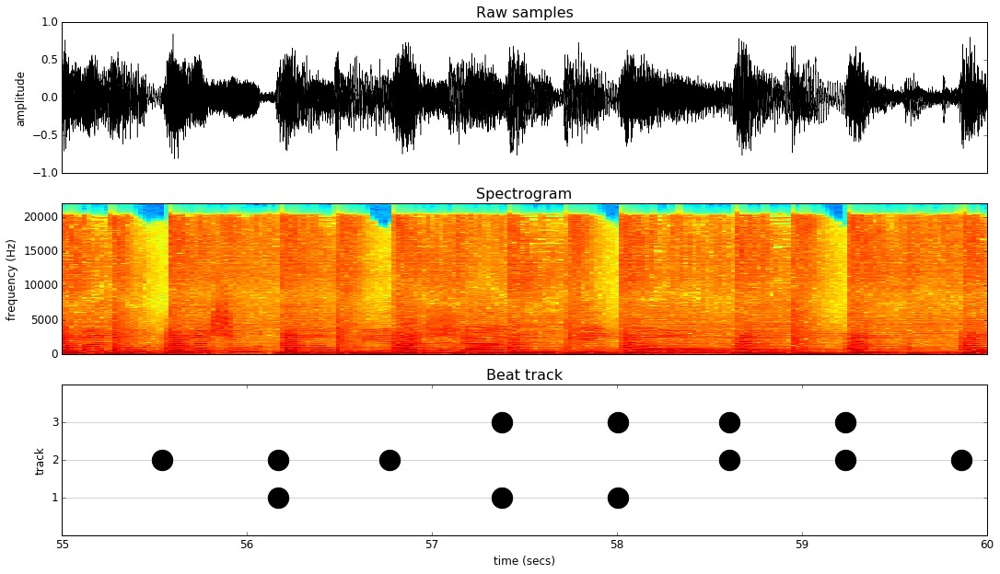
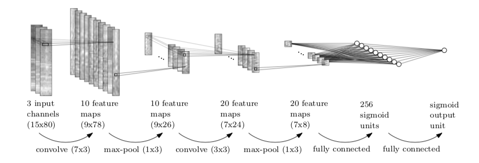
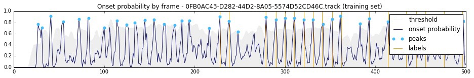

# Musical Onset Detection with Convolutional Neural Networks 

## Summary
From Audio File, Extract feature image like this



Then, Build model and train



result



## Description

This repository is implementation of Jan Schlüter and Sebastian Böck's ["IMPROVED MUSICAL ONSET DETECTION WITH CONVOLUTIONAL NEURAL NETWORKS"](http://www.ofai.at/~jan.schlueter/pubs/2014_icassp.pdf)

ABSTRACT:
>Musical onset detection is one of the most elementary tasks in music analysis, but still only solved imperfectly for polyphonic music signals. Interpreted as a computer vision problem in spectrograms, Convolutional Neural Networks (CNNs) seem to be an ideal fit. On a dataset of about 100 minutes of music with 26k annotated onsets, we show that CNNs outperform the previous state-of-the-art while requiring less manual preprocessing. Investigating their inner workings, we find two key advantages over hand-designed methods: Using separate detectors for percussive and harmonic onsets, and combining results from many minor variations of the same scheme. The results suggest that even for well-understood signal processing tasks, machine learning can be superior to knowledge engineering.

Using Chainer, implemented musical onset detectioner and apply it to Taikosanjiro which is sounds game like taiko-no-tatsujin


## Usage

### Requirement

- python3
- pytorch
- soundfile
- librosa
- tqdm

### Install Pytorch

you can download from [here](https://pytorch.org/get-started/locally/)

### Command

- install requirement

```
$ pip install -r reqirement.txt
```
- then, train model.

```
$ python train.py don
$ python train.py ka
```

- then predict onset probability.

```
$ python infer.py don
$ python infer.py ka
```

- and create notes.

```
$ python synthesyze.py 
```

### References

- [IMPROVED MUSICAL ONSET DETECTION WITH CONVOLUTIONAL NEURAL NETWORKS](http://www.ofai.at/~jan.schlueter/pubs/2014_icassp.pdf)

- [Dance Dance Convolution](https://arxiv.org/pdf/1703.06891.pdf)

- [Create with AI](http://createwith.ai/paper/20170327/393)

- Tom Mullaney's Article; [Rythm Games with Neural Networks](http://tommymullaney.com/projects/rhythm-games-neural-networks)

- Woody's Article; [Musical Data Processing with CNN](https://qiita.com/woodyOutOfABase/items/01cc43fafe767d3edf62)
